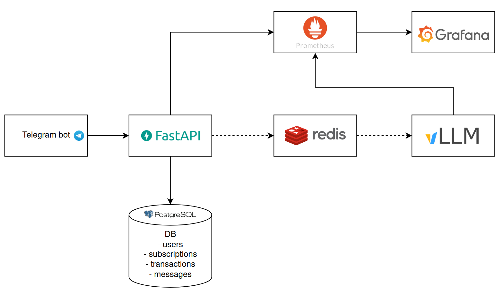

# LLM Service with Telegram Bot

A B2C service that provides access to an LLM model through a Telegram bot, with subscription-based access control and coin-based wallet system.

## Architecture


## Features

- Telegram bot interface for user interaction
- Subscription-based access control
- Coin-based wallet system 
- Background processing of LLM requests using Redis
- PostgreSQL database with SQLAlchemy ORM
- FastAPI backend with JWT authentication

## Setup

1. Clone the repository:
```bash
git clone git@github.com:Darinochka/llm-service.git
cd llm-service
```

2. Create a `.env` file from the template:
```bash
cp .env.example .env
```

3. Update the `.env` file with your configuration:
- Set your Telegram bot token
- Configure database credentials
- Set JWT secret key
- Update vLLM API URL

4. Build and start the services:
```bash
docker-compose up --build
```

5. Run database migrations:
```bash
docker compose exec api python -m alembic upgrade head
```

### Database Schema

- **users**: User information, authentication, and wallet balance
- **subscriptions**: Active user subscriptions
- **transactions**: Payment and coin transaction records
- **messages**: Chat history with LLM
- **wallet**: User wallet information and balance

## API Endpoints

### Authentication

- `POST /token`: Get JWT token for authentication (requires telegram_id)

### Public Endpoints

- `POST /message`: Submit a message to the LLM (requires active subscription)
- `GET /history`: Get message history
- `POST /subscribe`: Create a subscription (costs coins per minute)
- `GET /me`: Get user info
- `GET /wallet`: Check wallet balance
- `POST /add_coins`: Add coins to user's wallet

### Admin Endpoints

- `GET /admin/users`: List all users
- `POST /admin/subscribe/{user_id}`: Force subscribe a user

All endpoints except `/token` require JWT authentication via Bearer token.

## Telegram Bot Commands

- `/start`: Register/login (get 20 free coins)
- `/subscribe`: Show subscription status and payment info
- `/wallet`: Check your coin balance and add more coins

## Wallet System

- Each user starts with 20 free coins
- Subscription costs 10 coins per minute
- Users can add more coins through the Telegram bot
- Coin balance is displayed in the wallet interface
- Transaction history is maintained for all coin operations

## Development

1. Install dependencies:
```bash
pip install -r requirements.txt
```

2. Run the API service:
```bash
uvicorn app.main:app --reload
```

3. Run the Telegram bot:
```bash
python app/run_bot.py
```

## Monitoring

- FastAPI docs: http://localhost:8000/docs
- Prometheus metrics: http://localhost:9090
- Grafana dashboard: http://localhost:3000
